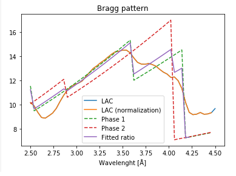
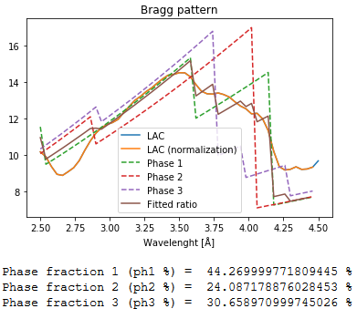
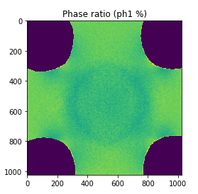
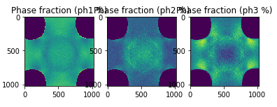

[Return to table of contents](index.md) 
# Phase fitting
This package contains python functions for the fitting of phase transformation of Bragg attenuation patterns.
This assumes the measured linear attenuation coefficient μ, is a linear combination of a phases with a given a-priori reference linear attenuation coefficients φ

Currently implemented are the solvers for the 2 phases case (i=1,2) and 3 phases case (i=1,2,3).

# IMPORTANT NOTES:

- In the following functions spectrum, lambda_range_norm, lambda_range_edges must all be in the same domain (by default is lambda (wavelenght) but could be bin index or tof).
- Currently texture is not implemented. For a refined method accuracy, this should be modeled in the reference phase spectra.

# FUNCTION LIST:

## phasefitting_1D.py: 
Functions for phase fitting of 1D-arrays. Example:

 

### phase_ratio_linearcomb: 
Fit two phases

__INPUTS__:
|Parameter| Description|
|----------|------------|
| lac | 1d array the attenuation -log(I/I0) (1darray) [REQUIRED]|
| spectrum | spectrum range corresponding to lac (1darray) [REQUIRED]|
| phase1lac | lac of the phase 1 (1darray) [REQUIRED]|
| phase2lac | lac of the phase 2 (1darray) [REQUIRED]|
| spectrum_phase | spectrum range corresponding to phase1lac and phase2lac (1darray) [REQUIRED]|
| lambda_range_norm | lambda range where to normalize spectra ([lambda1, lambda2]) [REQUIRED]|
| lambda_range_edges =| lambda range where to do the fitting ([lambda1, lambda2]) [REQUIRED]|
| est_phi | estimate phase 1 weight [Default = 0.5]|
| method | fitting method [Default = 'least_squares']|
| bool_SG | set to True to perform Savitzky-Golay filtering [Default = False]|
| SG_w | window size of S-G filter [Default = 5]|
| SG_n | order of S-G filter [Default = 1]|
| bool_print | set to True to print output [Default = False]|

__OUTPUTS__: dictionary with the following fit in the dimension of the mask
|Parameter| Description|
|----------|------------|
| 'phi' | phase 1 weight |

### phase_ratio_linearcomb_three: 
Fit three phases Example:

 

__INPUTS__:
|Parameter| Description|
|----------|------------|
| lac | 1d array the attenuation -log(I/I0) (1darray) [REQUIRED]|
| spectrum | spectrum range corresponding to lac (1darray) [REQUIRED]|
| phase1lac | lac of the phase 1 (1darray) [REQUIRED]|
| phase2lac | lac of the phase 2 (1darray) [REQUIRED]|
| phase3lac | lac of the phase 3 (1darray) [REQUIRED]|
| spectrum_phase | spectrum range corresponding to phase1lac,phase2lac and phase3lac (1darray) [REQUIRED]|
| lambda_range_norm | lambda range where to normalize spectra ([lambda1, lambda2]) [REQUIRED]|
| lambda_range_edges | lambda range where to do the fitting ([lambda1, lambda2]) [REQUIRED]|
| est_f1 | estimate phase 1 weight [Default = 0.333]|
| est_f2 | estimate phase 2 weight [Default = 0.333]|
| est_f3 | estimate phase 3 weight [Default = 0.334]|
| method | fitting method [Default = 'least_squares']|
| bool_SG | set to True to perform Savitzky-Golay filtering [Default = False]|
| SG_w | window size of S-G filter [Default = 5]|
| SG_n | order of S-G filter [Default = 1]|
| bool_print | set to True to print output [Default = False]|

__OUTPUTS__: dictionary with the following fit in the dimension of the mask
|Parameter| Description|
|----------|------------|
| 'phi1' | phase 1 weight|
| 'phi2' | phase 2 weight|
| 'phi3' | phase 3 weight|

## phasefitting_2D.py: 
Functions for phase fitting of 2D stack of TOF data in the form of 3darray (x,y,lambda)

### phase_ratio_linearcomb_2D: 
Fit two phases. Example:

 

__INPUTS__:
|Parameter| Description|
|----------|------------|
| lac_tof | 3darray the attenuation -log(I/I0) (x,y,lambda) [REQUIRED]|
| spectrum | spectrum range corresponding to lac (1darray) [REQUIRED]|
| phase1lac | lac of the phase 1 (1darray) [REQUIRED]|
| phase2lac | lac of the phase 2 (1darray) [REQUIRED]|
| spectrum_phase | spectrum range corresponding to phase1lac and phase2lac (1darray) [REQUIRED]|
| lambda_range_norm | lambda range where to normalize spectra ([lambda1, lambda2]) [REQUIRED]|
| lambda_range_edges | lambda range where to do the fitting ([lambda1, lambda2]) [REQUIRED]|
| calibration_matrix | calibration matrix with the coefficients to convert from spectrum to lambda size (x,y,[X0,k]). Will convert to lambda using formula Y = X0 + kX where X is spectrum for each pixel (x,y) [Default = np.ndarray([0])]|
| mask | mask of where to perform the fit (x,y) [Default = np.ndarray([0])]|
| auto_mask | if True and mask is not given will automatically mask the region based on the mask_thresh thresholds [Default = True]|
| mask_thresh | low and high threshold for the automatic mask ([thresh_low, thresh_high]) [Default = np.ndarray([0])]|
| est_phi | estimate phase 1 weight [Default = 0.5]|
| method | fitting method [Default = 'least_squares']|
| bool_SG | set to True to perform Savitzky-Golay filtering [Default = False]|
| SG_w | window size of S-G filter [Default = 5]|
| SG_n | order of S-G filter [Default = 1]|
| bool_save | set to True to save output [Default = False]|
| bool_print | set to True to print output [Default = False]|
| debug_idx | pixel coordinates where to test the single pixel fitting ([pixel_x, pixel_y]) [Default = []]|

__OUTPUTS__: dictionary with the following fit in the dimension of the mask
|Parameter| Description|
|----------|------------|
| 'phase_ratio' | phase 1 weight|

### phase_ratio_linearcomb_three_2D: 
Fit three phases. Example:

 

__INPUTS__:
|Parameter| Description|
|----------|------------|
| lac_tof | 3darray the attenuation -log(I/I0) (x,y,lambda) [REQUIRED]|
| spectrum | spectrum range corresponding to lac (1darray) [REQUIRED]|
| phase1lac | lac of the phase 1 (1darray) [REQUIRED]|
| phase2lac | lac of the phase 2 (1darray) [REQUIRED]|
| phase3lac | lac of the phase 3 (1darray) [REQUIRED]|
| spectrum_phase | spectrum range corresponding to phase1lac,phase2lac and phase3lac (1darray) [REQUIRED]|
| lambda_range_norm | lambda range where to normalize spectra ([lambda1, lambda2]) [REQUIRED]|
| lambda_range_edges | lambda range where to do the fitting ([lambda1, lambda2]) [REQUIRED]|
| calibration_matrix | calibration matrix with the coefficients to convert from spectrum to lambda size (x,y,[X0,k]). Will convert to lambda using formula Y = X0 + kX where X is spectrum for each pixel (x,y) [Default = np.ndarray([0])]|
| mask | mask of where to perform the fit (x,y) [Default = np.ndarray([0])]|
| auto_mask | if True and mask is not given will automatically mask the region based on the mask_thresh thresholds [Default = True]|
| mask_thresh | low and high threshold for the automatic mask ([thresh_low, thresh_high]) [Default = np.ndarray([0])]|
| est_f1 | estimate phase 1 weight [Default = 0.333]|
| est_f2 | estimate phase 2 weight [Default = 0.333]|
| est_f3 | estimate phase 3 weight [Default = 0.334]|
| method | fitting method [Default = 'least_squares']|
| bool_SG | set to True to perform Savitzky-Golay filtering [Default = False]|
| SG_w | window size of S-G filter [Default = 5]|
| SG_n | order of S-G filter [Default = 1]|
| bool_save | set to True to save output [Default = False]|
| bool_print | set to True to print output [Default = False]|
| debug_idx | pixel coordinates where to test the single pixel fitting ([pixel_x, pixel_y]) [Default = []]|

__OUTPUTS__: dictionary with the following fit in the dimension of the mask
|Parameter| Description|
|----------|------------|
| 'phase1_ratio' | phase 1 weight|
| 'phase2_ratio' | phase 2 weight|
| 'phase3_ratio' | phase 3 weight|
