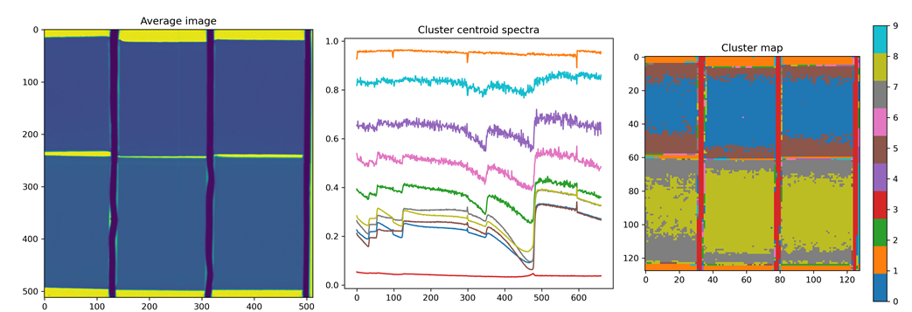

[Return to table of contents](index.md) 
# Reduction Tools
The reduction_tools.py module contains various functions for the data processing/reduction/filtering.
Please inspect the file for the full list of the functions. Here we report on a few key functions.

## DataFiltering
Carries out data filtering with either moving average or gaussian kernels to 2D image, or 3D stacks of ToF images.
If the kernel is a 2D array and the image is a 2D array the routine will process a 2D convolution. If the kernel is a 2D array and the image is 3D-ToF, each ToF frame will be convoluted with the 2D kernel. If kernel is 3D and image is 3D-ToF, the routine will process a 3D convolution.

__INPUTS__:

|Parameter| Description|
|----------|------------|
| mysignal | 2D or 3D array with the image or stack of images [REQUIRED]|
| BoxKernel | Size of a rectangular box kernel (Example: [10,2,2]) [Default = []]|
| GaussianKernel | Size of a gaussian kernel (Example: [10,2,2])  [Default = []]|
| bool_print | If set to true the function will print the input and output images [Default = False]|

## SpectralSegmentation
Performs a K-means segmentation of regions with similar spectra. The number of segmentation clusters can be chosen as an input.

__INPUTS__:

|Parameter| Description|
|----------|------------|
| T_tof | 3D array with the stack of TOF images [REQUIRED]|
| clusters | Number of allowed different spectra in the segmentation (int) [REQUIRED]|
| spectrum | spectrum range corresponding to Ttof third dimension (1darray) [Optional]|
| spectrum_range | range corresponding to lambda where to perform the fitting ([lambda1, lambda2]) [Default = []]|
| bool_print | If set to true the function will print the input and output images [Default = False]|

__OUTPUTS__: dictionary with the following

|Parameter| Description|
|----------|------------|
| 'T_segmented' | Segmented image |
| 'spectra' | Corresponding segmented spectra |

 

## savitzky_golay
Advance smoothing of a signal. For documentation see [here](https://scipy-cookbook.readthedocs.io/items/SavitzkyGolay.html).
