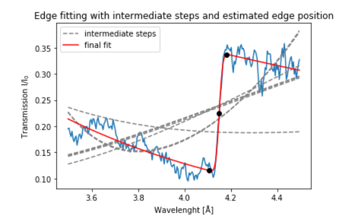
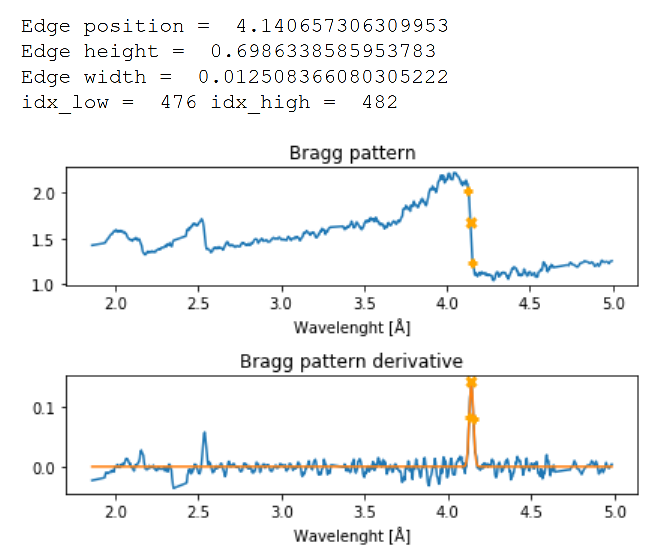

[Return to table of contents](index.md) 
# Single Bragg edge fitting
This package contains python functions for the fitting of a single Bragg edge pattern.
Currently implemented are:

- Advanced Bragg Edge Fitting: 7 parameters fit as in Ramadhan et al. [2019] {a_0,b_0,a_{hkl},b_{hkl},λ_{hkl},σ,τ}

=\exp{[-a_0+b_0\lambda]}\times(\exp{[-(a_{hkl}+b_{hkl}\lambda)]+\{1-\exp{[-(a_{hkl}+b_{hkl}\lambda)]\})\times\frac{1}{2}[\mathrm{erfc}(-\frac{\lambda-\lambda_{hkl}}{2^{1/2}\sigma})-\exp{(-\frac{\lambda-\lambda_{hkl}}{\tau}+\frac{\sigma^2}{2\tau^2})}\times\mathrm{erfc}(-\frac{\lambda-\lambda_{hkl}}{2^{1/2}\sigma}+\frac{\sigma}{\tau})])

- Gaussian Bragg Edge Fitting: This methods takes the attenuation or transmission derivative and fits the edge to a Gaussian, returning centroid, height, and width of the Gaussian fit. The height is converted to the bragg edge slope and the bragg edge height is calculated as the integral of the gaussian fit.

# IMPORTANT NOTES:

- In the following functions spectrum and spectrum_range, and eventually initial guesses and boundary conditions must all be in the same domain (by default is lambda (wavelenght) but could be bin index or tof).
- (!) For noisy data the fitting may be challenging. Try playing with initial guesses and boundary conditions to help the fitting module. Especially, try different inputs of initial guesses of the edge width and height.
- For increased efficiency of the image fitting it is highly reccomended to run first the fitting in debugging mode by setting the debug_idx on a desired pixel location, and use the obtained values as initial guesses.
- Boundary conditions may be useful in the cases of double edges / texture to impose the fitting of a specific bragg edge.

## Known bugs
- Fitting may fail in case of dataset containing inf's and NaN's values. If that is the case try increasing moving average or other image processing to cleanup data.

# FUNCTION LIST:

## edgefitting_1D.py: 
Functions for edge fitting of 1D-arrays

### AdvancedBraggEdgeFitting
Advanced Bragg Edge Fitting. Printout example:

 

__INPUTS__:

|Parameter| Description|
|----------|------------|
| signal   | 1darray of the signal containing the Bragg edge (1darray) [REQUIRED]|
| spectrum | spectrum range corresponding to signal (1darray) [REQUIRED]|
| spectrum_range | range corresponding to lambda where to perform the fitting ([lambda1, lambda2]) [Default = []]|
| est_pos | estimated bragg edge position (in spectrum_range dimension) [Default = 0]|
| est_sigma | expected Gaussian broadening [Default = 1]|
| est_alpha | expected decay constant, a moderator property [Default = 1]|
| bool_smooth | set to True to perform Savitzky-Golay filtering of the transmission derivative [Default = False]|
| smooth_w | window size of S-G filter [Default = 5]|
| smooth_n | order of S-G filter [Default = 1]|
| bool_linear | flag to activate linear spectrum assumptions at the sides of the edge (otherwise exponential) [Default = False]|
| bool_print | flag to activate printing of figures [Default = False]|

__OUTPUTS__: dictionary with the following fit in the dimension of the mask
|Parameter| Description|
|----------|------------|
| 't0' | fitted bragg edge position |
| 'sigma' | fitted Gaussian broadening |
| 'alpha' | fitted decay constant (moderator property) |
| 'a1, a2, a5, a6' | parameters for spectrum besides the edge: a1 and a2 before, a5 and a6 after the edge |
| 'final_result' | fitting result after 7th iteration |
| 'fitted_data' | final fitted spectrum |
| 'pos_extrema' | extrema of the bragg edges |
| 'height' | fitted height of the bragg edge |

### GaussianBraggEdgeFitting
Gaussian Bragg Edge Fitting. Printout example:

 

__INPUTS__:

|Parameter| Description|
|----------|------------|
| signal | 1darray of the spectrum containing the Bragg edge (1darray) [REQUIRED] |
| spectrum | spectrum range corresponding to signal (1darray) [REQUIRED]|
| spectrum_range | range corresponding to lambda where to perform the fitting ([lambda1, lambda2]) [Default = []]|
| est_pos | estimated bragg edge position [Default = 0]|
| est_wid | estimated bragg edge width [Default = 0]|
| est_h | estimated bragg edge height [Default = 0]|
| pos_BC | boundary conditions for the bragg edge position fit ([lambda1, lambda2]) [Default = 0]|
| wid_BC | boundary conditions for the bragg edge width fit ([lambda1, lambda2]) [Default = 0]|
| h_BC | boundary conditions for the bragg edge height fit ([lambda1, lambda2]) [Default = 0]|
| bool_log | set to True to perform log norm and convert to attenuation [Default = True]|
| bool_smooth | set to True to perform Savitzky-Golay filtering of the transmission derivative [Default = False]|
| smooth_w | window size of S-G filter [Default = 5]|
| smooth_n | order of S-G filter [Default = 1]|
| bool_linear | flag to activate linear spectrum assumptions at the sides of the edge (otherwise exponential) [Default = False]|
| bool_print | flag to activate printing of figures [Default = False]|

__OUTPUTS__: dictionary with the following fits

|Parameter| Description|
|----------|------------|
| 'edge_position' | edge position |
| 'edge_height'| edge height |
| 'edge_width' | edge width  |
| 'edge_slope' | edge slope |
| 'median_image' | median Transmission image in the selected lambda range|

## edgefitting_2D.py: 
Functions for phase fitting of 2D stack of TOF data in the form of 3darray (x,y,lambda)

### AdvancedBraggEdgeFitting_2D 
Advanced Bragg Edge Fitting for all pixels in an image.

__INPUTS__:

|Parameter| Description|
|----------|------------|
| Ttof | 3darray of the image TOF stack containing the Bragg edge (x,y,lambda) [REQUIRED] |
| spectrum | spectrum range corresponding to Ttof third dimension (1darray) [REQUIRED]|
| spectrum_range | range corresponding to lambda where to perform the fitting ([lambda1, lambda2]) [Default = []]|
| calibration_matrix | calibration matrix with the coefficients to convert from spectrum to lambda size (x,y,[X0,k]). Will convert to lambda using formula Y = X0 + kX where X is spectrum for each pixel (x,y) [Default = np.ndarray([0])]|
| mask | mask of where to perform the fit (x,y) [Default = np.ndarray([0])]|
| auto_mask | if True and mask is not given will automatically mask the region based on the mask_thresh thresholds [Default = True]|
| mask_thresh | low and high threshold for the automatic mask ([thresh_low, thresh_high]) [Default = np.ndarray([0])]|
| est_pos | estimated bragg edge position (in spectrum_range dimension) [Default = 0]|
| est_sigma | expected Gaussian broadening [Default = 1]|
| est_alpha | expected decay constant, a moderator property [Default = 1]|
| bool_smooth | set to True to perform Savitzky-Golay filtering of the transmission derivative [Default = False]|
| smooth_w | window size of S-G filter [Default = 5]|
| smooth_n | order of S-G filter [Default = 1]|
| bool_linear | flag to activate linear spectrum assumptions at the sides of the edge (otherwise exponential) [Default = False]|
| bool_save | set to True to save output [Default = False]|
| bool_print | set to True to print output [Default = False]|
| debug_idx | pixel coordinates where to test the single pixel fitting ([pixel_x, pixel_y]) [Default = []]|

__OUTPUTS__: dictionary with the following fit in the dimension of the mask
|Parameter| Description|
|----------|------------|
| 'edge_position' | edge position |
| 'edge_height'| edge height |
| 'edge_width'| edge width  |
| 'median_image'| median Transmission image in the selected lambda range |

### GaussianBraggEdgeFitting_2D: 
Gaussian Bragg Edge Fitting for all pixels in an image.

__INPUTS__:

|Parameter| Description|
|----------|------------|
| Ttof | 3darray of the image TOF stack containing the Bragg edge (x,y,lambda) [REQUIRED]|
| spectrum | spectrum range corresponding to signal (1darray) [REQUIRED]|
| spectrum_range | range corresponding to lambda where to perform the fitting ([lambda1, lambda2]) [Default = []]|
| calibration_matrix | calibration matrix with the coefficients to convert from spectrum to lambda size (x,y,[X0,k]). Will convert to lambda using formula Y = X0 + kX where X is spectrum for each pixel (x,y) [Default = np.ndarray([0])]|
| mask | mask of where to perform the fit (x,y) [Default = np.ndarray([0])]|
| auto_mask | if True and mask is not given will automatically mask the region based on the mask_thresh thresholds [Default = True]|
| mask_thresh | low and high threshold for the automatic mask ([thresh_low, thresh_high]) [Default = np.ndarray([0])]|
| est_pos | estimated bragg edge position [Default = 0]|
| est_wid | estimated bragg edge width [Default = 0]|
| est_h | estimated bragg edge height [Default = 0]|
| pos_BC | boundary conditions for the bragg edge position fit ([lambda1, lambda2]) [Default = 0]|
| wid_BC | boundary conditions for the bragg edge width fit ([lambda1, lambda2]) [Default = 0]|
| h_BC | boundary conditions for the bragg edge height fit ([lambda1, lambda2]) [Default = 0]|
| bool_log | set to True to perform log norm and convert to attenuation [Default = True]|
| bool_smooth | set to True to perform Savitzky-Golay filtering of the transmission derivative [Default = False]|
| smooth_w | window size of S-G filter [Default = 5]|
| smooth_n | order of S-G filter [Default = 1]|
| bool_save | set to True to save output [Default = False]|
| bool_print | set to True to print output [Default = False]|
| debug_idx | pixel coordinates where to test the single pixel fitting ([pixel_x, pixel_y]) [Default = []]|

__OUTPUTS__: dictionary with the following fits

|Parameter| Description|
|----------|------------|
| 'edge_position' | edge position |
| 'edge_height' | edge height |
| 'edge_width'| edge width  |
| 'edge_slope'| edge slope |
| 'median_image'| median Transmission image in the selected lambda range|
